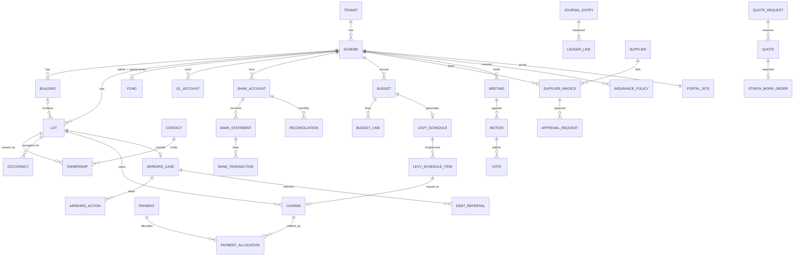
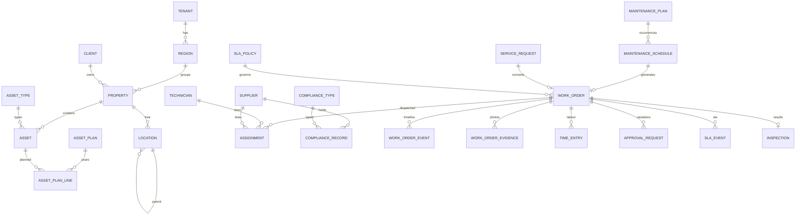
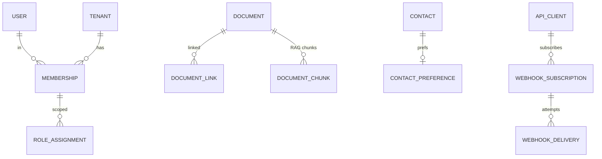

# Entity Relationship Diagrams (PROPOSED)

## Strata

```mermaid
erDiagram
  TENANT ||--o{ SCHEME : has
  SCHEME ||--o{ BUILDING : has
  SCHEME ||--o{ LOT : has
  BUILDING |o--o{ LOT : contains
  LOT ||--o{ OWNERSHIP : "owned via"
  CONTACT ||--o{ OWNERSHIP : holds
  LOT ||--o{ OCCUPANCY : "occupied via"
  SCHEME ||--|{ FUND : "admin + capital works"
  SCHEME ||--o{ GL_ACCOUNT : chart
  SCHEME ||--o{ BANK_ACCOUNT : trust
  SCHEME ||--o{ BUDGET : annual
  BUDGET ||--o{ BUDGET_LINE : lines
  BUDGET ||--o| LEVY_SCHEDULE : generates
  LEVY_SCHEDULE ||--o{ LEVY_SCHEDULE_ITEM : instalments
  LEVY_SCHEDULE_ITEM ||--o| CHARGE : "issued as"
  LOT ||--o{ CHARGE : owes
  PAYMENT ||--o{ PAYMENT_ALLOCATION : allocates
  CHARGE ||--o{ PAYMENT_ALLOCATION : settled_by
  BANK_ACCOUNT ||--o{ BANK_STATEMENT : receives
  BANK_STATEMENT ||--o{ BANK_TRANSACTION : lines
  BANK_ACCOUNT ||--o{ RECONCILIATION : monthly
  JOURNAL_ENTRY ||--|{ LEDGER_LINE : balanced
  LOT ||--o| ARREARS_CASE : tracked
  ARREARS_CASE ||--o{ ARREARS_ACTION : steps
  ARREARS_CASE ||--o{ DEBT_REFERRAL : referred
  SUPPLIER ||--o{ SUPPLIER_INVOICE : bills
  SCHEME ||--o{ SUPPLIER_INVOICE : pays
  SUPPLIER_INVOICE ||--o{ APPROVAL_REQUEST : approval
  QUOTE_REQUEST ||--o{ QUOTE : receives
  QUOTE ||--o| STRATA_WORK_ORDER : awarded
  SCHEME ||--o{ MEETING : holds
  MEETING ||--o{ MOTION : agenda
  MOTION ||--o{ VOTE : ballots
  SCHEME ||--o{ INSURANCE_POLICY : insured
  SCHEME ||--|| PORTAL_SITE : portal
```

## FM

```mermaid
erDiagram
  TENANT ||--o{ REGION : has
  REGION ||--o{ PROPERTY : groups
  CLIENT ||--o{ PROPERTY : owns
  PROPERTY ||--o{ LOCATION : tree
  LOCATION ||--o{ LOCATION : parent
  PROPERTY ||--o{ ASSET : contains
  ASSET_TYPE ||--o{ ASSET : types
  ASSET_PLAN ||--o{ ASSET_PLAN_LINE : years
  ASSET ||--o{ ASSET_PLAN_LINE : planned
  MAINTENANCE_PLAN ||--o{ MAINTENANCE_SCHEDULE : occurrences
  MAINTENANCE_SCHEDULE ||--o| WORK_ORDER : generates
  SERVICE_REQUEST ||--o| WORK_ORDER : converts
  WORK_ORDER ||--o{ ASSIGNMENT : dispatched
  TECHNICIAN ||--o{ ASSIGNMENT : does
  SUPPLIER ||--o{ ASSIGNMENT : does
  SUPPLIER ||--o{ COMPLIANCE_RECORD : holds
  COMPLIANCE_TYPE ||--o{ COMPLIANCE_RECORD : typed
  WORK_ORDER ||--o{ WORK_ORDER_EVENT : timeline
  WORK_ORDER ||--o{ WORK_ORDER_EVIDENCE : photos
  WORK_ORDER ||--o{ TIME_ENTRY : labour
  WORK_ORDER ||--o{ APPROVAL_REQUEST : variations
  SLA_POLICY ||--o{ WORK_ORDER : governs
  WORK_ORDER ||--o{ SLA_EVENT : sla
  WORK_ORDER ||--o| INSPECTION : results
```

## Shared

```mermaid
erDiagram
  USER ||--o{ MEMBERSHIP : in
  TENANT ||--o{ MEMBERSHIP : has
  MEMBERSHIP ||--o{ ROLE_ASSIGNMENT : scoped
  DOCUMENT ||--o{ DOCUMENT_LINK : linked
  DOCUMENT ||--o{ DOCUMENT_CHUNK : "RAG chunks"
  CONTACT ||--o| CONTACT_PREFERENCE : prefs
  API_CLIENT ||--o{ WEBHOOK_SUBSCRIPTION : subscribes
  WEBHOOK_SUBSCRIPTION ||--o{ WEBHOOK_DELIVERY : attempts
```
